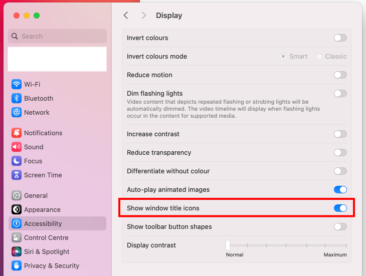

# dotfiles

## Bootstrap

### Requirement: Unix devtools

> [!IMPORTANT]
> DO NOT INSTALL XCODE! It's not necessary anymore.

Open the terminal:

```bash
xcode-select --install
```

This will download all the CLI devtools necessary.

### Requirement: Homebrew

```bash
# Install brew (get up-to-date method on brew.sh).
open https://brew.sh
```

### Requirement: Dropbox

```bash
brew install dropbox
```

- In "Backups", disable everything
- In "Sync"…
  - If possible, stick to the old Dropbox location (`/Users/$user/Dropbox/`)
  - Set "Default sync state for new files" to "Available offline"

> [!CAUTION]
> Then, let Dropbox sync **completely**. Don't do anything. This can take a lot of time.

### Requirement: 1Password

```bash
brew install 1Password
```

### Requirement: SSH Key

> [!CAUTION]
> Obsolete: use 1Password to store SSH Key (using ed25519).

Generate a new key:

```bash
ssh-keygen -t rsa -b 4096 -C "krokmou@berk.com"
pbcopy < ~/.ssh/id_rsa.pub
```

Then, add it on Github.

For the name, use either:

- `Private — $NAME`
- `$COMPANY_NAME — $NAME`

Where $NAME is taken from the "About This Mac" panel.

For example:

- `Private — MacBook Pro (15-inch, 2016)`

### Ready?

```bash
cd ~
mkdir Developer
chmod 700 Developer
chmod +a "group:everyone deny delete" Developer
cd Developer

# Repo.
git clone git@github.com:solarsailer/dotfiles.git

cd dotfiles
```

Note: we use `Developer` instead of `Code`. macOS adds an icon to folders named "Developer".

## Manual Configuration

### Alfred

First, you need to activate Alfred's Powerpack.

Then, authorize Dropbox's Apps folder to be used for syncing Alfred:

```bash
defaults write com.runningwithcrayons.Alfred-Preferences dropbox.allowappsfolder -bool TRUE
```

Finally, a few settings to set manually on a per-Mac basis:
- General
  - Set `⌘ + Space` as launcher shortcut
  - In permissions, add Alfred to "Accessibility" and "Full Disk Access"
- Appearance
  - In Light Mode, go to Appearance, set "Solar Sailer v4 (L)"
  - Switch to Dark Mode, set "Solar Sailer v4 (D)"
  - Switch back to Light Mode
- Features, Snippets:
  - Activate "Automatically expand snippets by keyword"

### Git

To set your git `user.email` & `user.name`, create a `.gitconfig` file manually in your `$HOME` folder and copy those values there:

```
[user]
  name = Firstname Lastname
  email = krokmou@berk.com
```

### Procedure

Move to `$HOME/Developer/dotfiles`. Then:

```bash
# Temporarily add brew to $PATH (before using fish).
export PATH=/opt/homebrew/bin:$PATH

# Install stow.
brew install stow

# Configure stow (see stow.bash in `scripts`).
stow --target=$HOME -R stow

# Configure fish.
stow -R fish

# Install fish.
brew install fish

# Then, read below to setup fish as default shell.
```

### Stow

Stow is configured to use "../.." as the default target. That means that you should put the dotfiles in a folder in your home. Like "$HOME/Developer/dotfiles".

If you have followed the previous instructions, it should already be there, making this step useless.

### Fish

Set fish as default shell:

* Check where fish is installed: `which fish`
* Add one of those:
  * Add `/opt/homebrew/bin/fish` to `/etc/shells`
  * Add `/usr/local/bin/fish` to `/etc/shells`
  * (Just need to be there, at the end, nothing more)
* Run one of those:
  * `chsh -s /opt/homebrew/bin/fish`
  * `chsh -s /usr/local/bin/fish`

Then:

```bash
fish_theme_classic # "Install" the theme
fisher install jethrokuan/z
fisher install jorgebucaran/getopts.fish
```

### Name

```
change_computer_name $NAME
```

### Python

Use pyenv to manage Python/pip properly:

```
pyenv install 3.$X
pyenv global 3.$X
pip install --upgrade pip
```

## Next Steps

Follow the different scripts in the `scripts` folder. Use the lines (or full script) if applicable to your situation.

I don't recommend to blindly run everything, but those are a good knowledge base to bootstrap a mac.

## Typography

> [!NOTE]
> Fonts are installed with Homebrew.

- Family: [JetBrains Mono](https://www.jetbrains.com/lp/mono/) ([Fira Code](https://github.com/tonsky/FiraCode) as fallback)
- Size: `14`

## Bonus

### Proxy Icon

Go to: `Accessibility > Display > Show window title icons`.



### Contact Card

Sync your contact, then in the Contacts app, choose your contact card, click on the "Card" menu, then "Make this my card".

### Input Sources

Use the alternative (and better) French keyboard in `system/Keyboard/frenumin.keylayout` and install it.

Copy the `.keylayout` to `~/Library/Keyboard Layouts/`.

### Retina or non-retina?

If you use a non-retina monitor, run this command:

```
defaults write -g CGFontRenderingFontSmoothingDisabled -bool NO
```

macOS Mojave removed the "Use LCD font smoothing when available" option in "General". It's better for retina screen, but awful on non-retina. This command will re-activate this option.

**DO NOT USE** with retina screens.

---

Thanks to [Peter Hajas](https://github.com/peterhajas/dotfiles) and [OSX for Hackers](https://gist.github.com/brandonb927/3195465#file-osx-for-hackers-sh-L619) for the inspiration.
